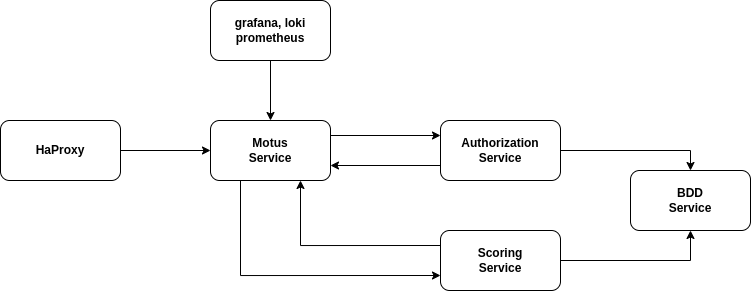
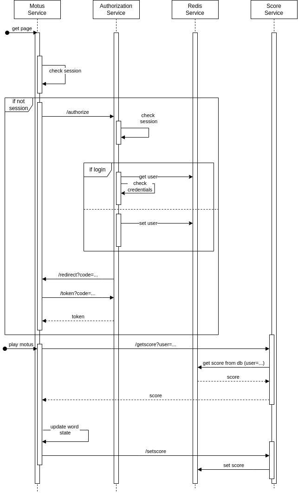
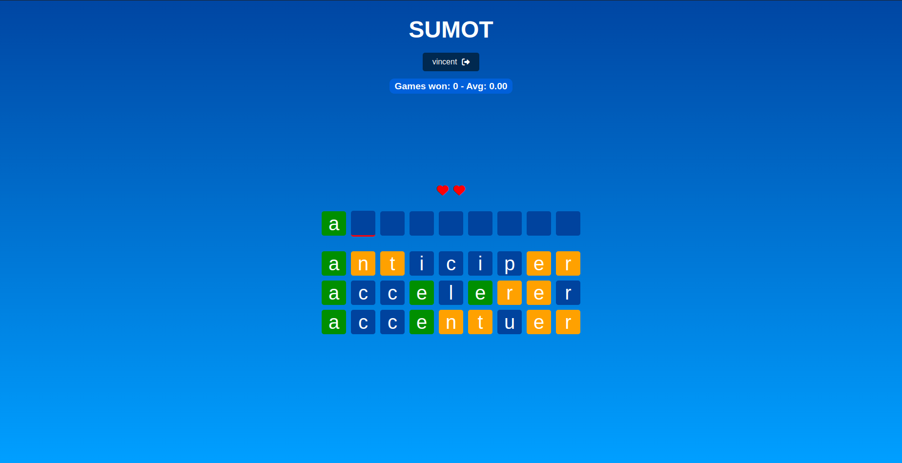
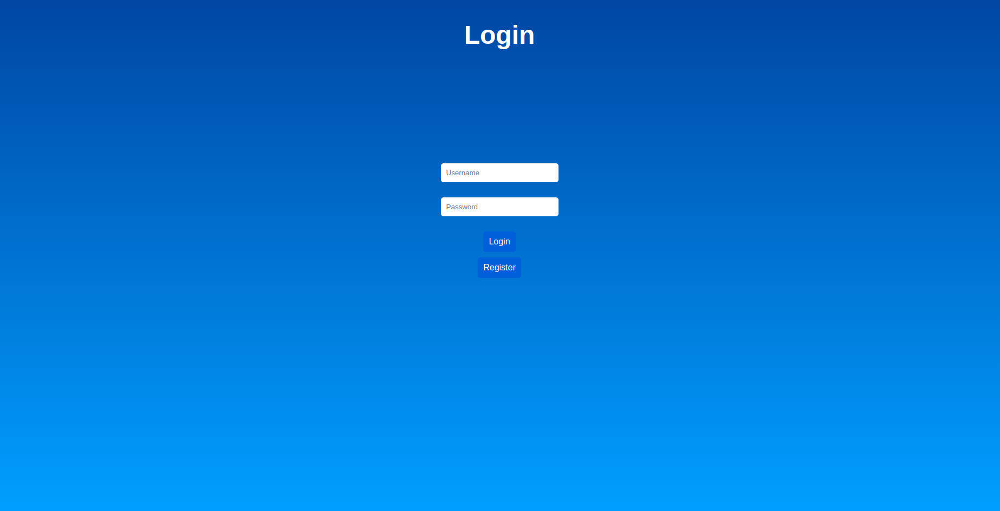
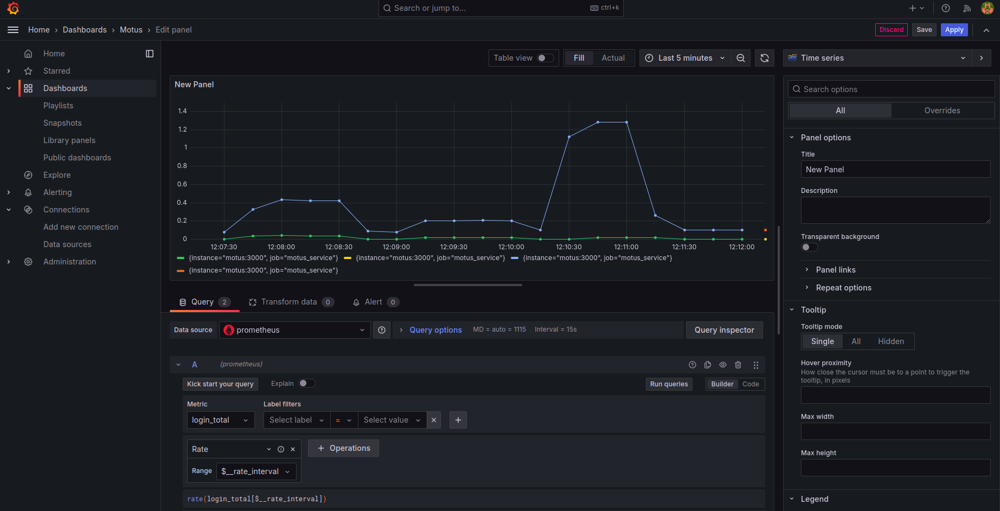

# Projet - SUMOT

## Description

SUMOT est une application basée sur l'architecture microservices. C'est un jeu reprenant le jeu du MOTUS où l'objectif est de trouver un mot en un minimum de coups.

Nous avons terminé le développement de l'application. Nous avons mis en place:

- Un microservice d'authentification. 
- Un microservice du jeu motus.
- Un microservice de score.
- Un microservice de redis pour la base de donnée.
- Un microservice reverse proxy pour le jeu du motus avec deux replicas.
- Un ensemble de microservices pour l'analyse des metrics.

## Installation

Tous les microservices sont des images docker. Ces images sont disponibles sur le docker hub.

Le projet est basé sur un docker-compose. Pour lancer le projet, il suffit de lancer la commande suivante :

```bash
docker-compose up --build
```

Puis le port utilisé est le 3005.

## Architecture générale

Voici l'architecture générale de l'application :



## Sequence diagram

Voici le diagramme de séquence de l'application :



Lorsque l'utilisateur lance l'application et que sa session n'est pas encore définie, il est redirigé vers le microservice d'authentification. Une fois authentifié, il est redirigé vers le service de motus. Ce microservice communique avec le microservice de score pour récupérer le score de l'utilisateur. Lorsque l'utilisateur a terminé une partie, le microservice de jeu communique avec le microservice de score pour mettre à jour le score de l'utilisateur.

## Score Management
- On utilise un serveur Node.js pour gérer les scores. Avec une api basée sur express.js. La base de donnée utilisée est Redis.
- Le port utilisé est le 3002.
- Le serveur propose deux entrées :
  - /getscore : pour récupérer le score
  - /setscore : pour modifier le score
  - La forme du retour est du JSON et est de la forme suivante :
    ```json
    {
      "gameWon": 0,
      "attempts": 0
    }
    ```
-  Ce service prend en charge plusieurs utilisateurs. 


## Next steps

- Deployer l'application sur un serveur et la rendre accessible à tous.

## Captures d'écran

### Le jeu



### L'authentification



### Le monitoring



